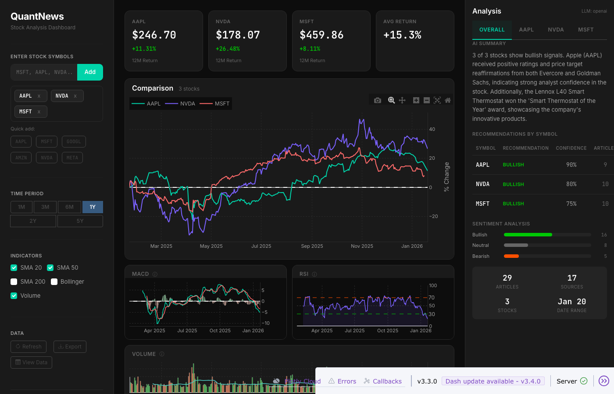

# QuantNews

Real-time stock analysis dashboard with LLM-powered news insights and technical indicators.



## Features

- **Multi-stock comparison** with normalized % change charts
- **Technical indicators**: SMA (20/50/200), Bollinger Bands, MACD, RSI
- **Per-symbol news tabs** with AI-powered recommendation banners
- **Sentiment analysis** with visual breakdowns and confidence scores
- **Live news feed** with structured LLM summaries
- **Data export** to Parquet format with DuckDB caching

## Quick Start

```bash
# Install dependencies
pip install -r requirements.txt

# Set up environment
cp .env.example .env  # Add your API keys

# Run the dashboard
python app.py
```

Open http://127.0.0.1:8050 in your browser.

## Configuration

| Variable | Description |
|----------|-------------|
| `OPENAI_API_KEY` | OpenAI API key for AI summaries |
| `ALPHA_VANTAGE_API_KEY` | Alpha Vantage API key for enhanced news coverage |

Alternatively, connect to a local LLM via LM Studio on port 1234. yfinance is used for news if no Alpha Vantage key is provided.

## Tech Stack

Dash + Plotly | DuckDB | yfinance | Bootstrap 5 (Darkly)
